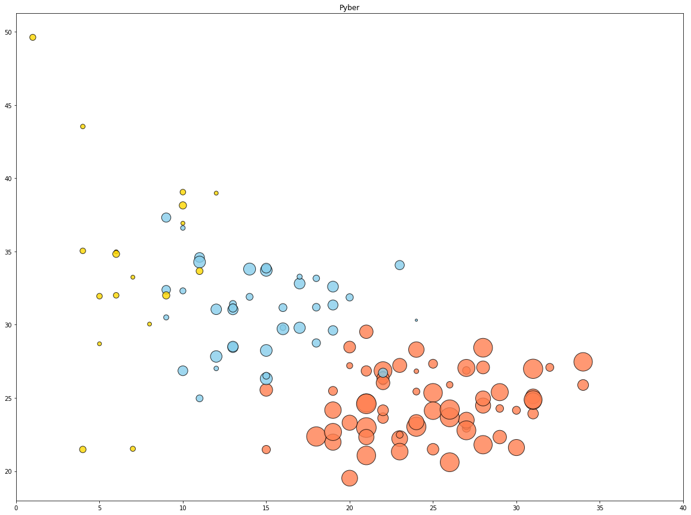
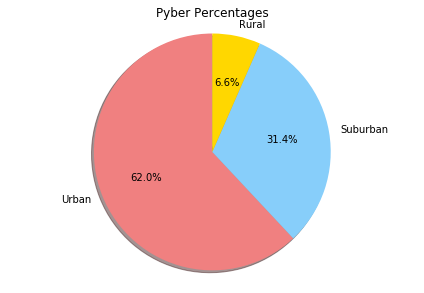
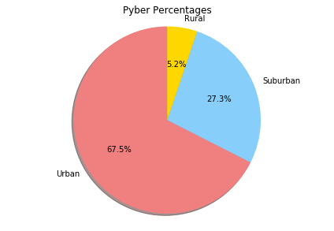
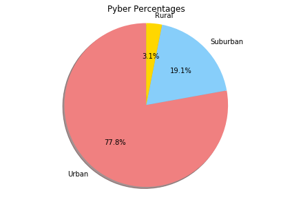

```python
import pandas as pd
import matplotlib.pyplot as plt 
import seaborn as sns
```


```python
filepath = "city_data.csv"
filepath2 = "ride_data.csv"
```


```python
city_data = pd.read_csv(filepath)
ride_data = pd.read_csv(filepath2)
```


```python
city_data.head()
```


<div>
<style>
    .dataframe thead tr:only-child th {
        text-align: right;
    }

    .dataframe thead th {
        text-align: left;
    }

    .dataframe tbody tr th {
        vertical-align: top;
    }
</style>
<table border="1" class="dataframe">
  <thead>
    <tr style="text-align: right;">
      <th></th>
      <th>city</th>
      <th>driver_count</th>
      <th>type</th>
    </tr>
  </thead>
  <tbody>
    <tr>
      <th>0</th>
      <td>Kelseyland</td>
      <td>63</td>
      <td>Urban</td>
    </tr>
    <tr>
      <th>1</th>
      <td>Nguyenbury</td>
      <td>8</td>
      <td>Urban</td>
    </tr>
    <tr>
      <th>2</th>
      <td>East Douglas</td>
      <td>12</td>
      <td>Urban</td>
    </tr>
    <tr>
      <th>3</th>
      <td>West Dawnfurt</td>
      <td>34</td>
      <td>Urban</td>
    </tr>
    <tr>
      <th>4</th>
      <td>Rodriguezburgh</td>
      <td>52</td>
      <td>Urban</td>
    </tr>
  </tbody>
</table>
</div>


```python
ride_data.head()
```


<div>
<style>
    .dataframe thead tr:only-child th {
        text-align: right;
    }

    .dataframe thead th {
        text-align: left;
    }

    .dataframe tbody tr th {
        vertical-align: top;
    }
</style>
<table border="1" class="dataframe">
  <thead>
    <tr style="text-align: right;">
      <th></th>
      <th>city</th>
      <th>date</th>
      <th>fare</th>
      <th>ride_id</th>
    </tr>
  </thead>
  <tbody>
    <tr>
      <th>0</th>
      <td>Sarabury</td>
      <td>2016-01-16 13:49:27</td>
      <td>38.35</td>
      <td>5403689035038</td>
    </tr>
    <tr>
      <th>1</th>
      <td>South Roy</td>
      <td>2016-01-02 18:42:34</td>
      <td>17.49</td>
      <td>4036272335942</td>
    </tr>
    <tr>
      <th>2</th>
      <td>Wiseborough</td>
      <td>2016-01-21 17:35:29</td>
      <td>44.18</td>
      <td>3645042422587</td>
    </tr>
    <tr>
      <th>3</th>
      <td>Spencertown</td>
      <td>2016-07-31 14:53:22</td>
      <td>6.87</td>
      <td>2242596575892</td>
    </tr>
    <tr>
      <th>4</th>
      <td>Nguyenbury</td>
      <td>2016-07-09 04:42:44</td>
      <td>6.28</td>
      <td>1543057793673</td>
    </tr>
  </tbody>
</table>
</div>


```python
ride_city_merge = pd.merge(ride_data, city_data, how = "left", on=["city", "city"])
ride_city_merge.head()
```


<div>
<style>
    .dataframe thead tr:only-child th {
        text-align: right;
    }

    .dataframe thead th {
        text-align: left;
    }

    .dataframe tbody tr th {
        vertical-align: top;
    }
</style>
<table border="1" class="dataframe">
  <thead>
    <tr style="text-align: right;">
      <th></th>
      <th>city</th>
      <th>date</th>
      <th>fare</th>
      <th>ride_id</th>
      <th>driver_count</th>
      <th>type</th>
    </tr>
  </thead>
  <tbody>
    <tr>
      <th>0</th>
      <td>Sarabury</td>
      <td>2016-01-16 13:49:27</td>
      <td>38.35</td>
      <td>5403689035038</td>
      <td>46</td>
      <td>Urban</td>
    </tr>
    <tr>
      <th>1</th>
      <td>South Roy</td>
      <td>2016-01-02 18:42:34</td>
      <td>17.49</td>
      <td>4036272335942</td>
      <td>35</td>
      <td>Urban</td>
    </tr>
    <tr>
      <th>2</th>
      <td>Wiseborough</td>
      <td>2016-01-21 17:35:29</td>
      <td>44.18</td>
      <td>3645042422587</td>
      <td>55</td>
      <td>Urban</td>
    </tr>
    <tr>
      <th>3</th>
      <td>Spencertown</td>
      <td>2016-07-31 14:53:22</td>
      <td>6.87</td>
      <td>2242596575892</td>
      <td>68</td>
      <td>Urban</td>
    </tr>
    <tr>
      <th>4</th>
      <td>Nguyenbury</td>
      <td>2016-07-09 04:42:44</td>
      <td>6.28</td>
      <td>1543057793673</td>
      <td>8</td>
      <td>Urban</td>
    </tr>
  </tbody>
</table>
</div>


```python
#Your objective is to build a [Bubble Plot](https://en.wikipedia.org/wiki/Bubble_chart) that showcases the relationship between four key variables:

#* Average Fare ($) Per City
#* Total Number of Rides Per City
#* Total Number of Drivers Per City
#* City Type (Urban, Suburban, Rural)
urban_cities = ride_city_merge[ride_city_merge['type'] == "Urban"]
suburban_cities = ride_city_merge[ride_city_merge['type'] == "Suburban"]
rural_cities = ride_city_merge[ride_city_merge['type'] == "Rural"]
```


```python
urban_ride_count = urban_cities.groupby(["city"]).count()["ride_id"]
urban_average_fair = urban_cities.groupby(['city']).mean()["fare"]
urban_driver_count = urban_cities.groupby(["city"]).mean()["driver_count"]

suburban_ride_count = suburban_cities.groupby(["city"]).count()["ride_id"]
suburban_average_fair = suburban_cities.groupby(['city']).mean()["fare"]
suburban_driver_count = suburban_cities.groupby(["city"]).mean()["driver_count"]

rural_ride_count = rural_cities.groupby(["city"]).count()["ride_id"]
rural_average_fair = rural_cities.groupby(['city']).mean()["fare"]
rural_driver_count = rural_cities.groupby(["city"]).mean()["driver_count"]

```


```python
plt.figure(figsize=(20, 15))
plt.scatter(x =urban_ride_count, y=urban_average_fair, s= 15*urban_driver_count, c="coral", edgecolor="black", alpha=0.8)
plt.scatter(x =suburban_ride_count, y=suburban_average_fair, s= 15*suburban_driver_count, c="skyblue", edgecolor="black", alpha=0.8)
plt.scatter(x =rural_ride_count, y=rural_average_fair, s= 15*rural_driver_count, c="gold", edgecolor="black", alpha=0.8)
plt.xlim((0,40))
plt.title("Pyber")
plt.show()
```





```python
#In addition, you will be expected to produce the following three pie charts:

#* % of Total Fares by City Type
#* % of Total Rides by City Type
#* % of Total Drivers by City Type

total_fare = ride_city_merge['fare'].sum()
urban_fare = urban_cities['fare'].sum()
suburban_fare = suburban_cities['fare'].sum()
rural_fare = rural_cities['fare'].sum()

urban_percentage =urban_fare/total_fare*100
suburban_percentage=suburban_fare/total_fare*100
rural_percentage=rural_fare/total_fare*100


```


```python
labels = ['Urban', 'Suburban', 'Rural']
sizes = [urban_percentage, suburban_percentage, rural_percentage]
colors = ['lightcoral', 'lightskyblue', 'gold']
plt.pie(sizes, colors=colors, shadow=True, startangle=90, labels=labels, autopct='%1.1f%%')
plt.axis('equal')
plt.tight_layout()
plt.title("Pyber Percentages")
plt.show()
#* % of Total Fares by City Type
```





```python
#* % of Total Rides by City Type
total_rides = ride_city_merge['ride_id'].count()
urban_rides = urban_cities['ride_id'].count()
suburban_rides = suburban_cities['ride_id'].count()
rural_rides = rural_cities['ride_id'].count()


urban_percentage =urban_rides/total_rides*100
suburban_percentage=suburban_rides/total_rides*100
rural_percentage=rural_rides/total_fare*100

labels = ['Urban', 'Suburban', 'Rural']
sizes = [urban_percentage, suburban_percentage, rural_percentage]
colors = ['lightcoral', 'lightskyblue', 'gold']
plt.pie(sizes, colors=colors, shadow=True, startangle=90, labels=labels, autopct='%1.1f%%')
plt.axis('equal')
plt.tight_layout()
plt.title("Pyber Percentages")
plt.show()

```





```python
#* % of Total Drivers by City Type
total_drivers = city_data['driver_count'].sum()
urban_drivers = city_data[city_data['type'] == "Urban"]['driver_count'].sum()
suburban_drivers = city_data[city_data['type'] == "Suburban"]['driver_count'].sum()
rural_drivers = city_data[city_data['type'] == "Rural"]['driver_count'].sum()


urban_percentage =urban_drivers/total_drivers*100
suburban_percentage=suburban_drivers/total_drivers*100
rural_percentage=rural_drivers/total_drivers*100

labels = ['Urban', 'Suburban', 'Rural']
sizes = [urban_percentage, suburban_percentage, rural_percentage]
colors = ['lightcoral', 'lightskyblue', 'gold']
plt.pie(sizes, colors=colors, shadow=True, startangle=90, labels=labels, autopct='%1.1f%%')
plt.axis('equal')
plt.tight_layout()
plt.title("Pyber Percentages")
plt.show()

```




